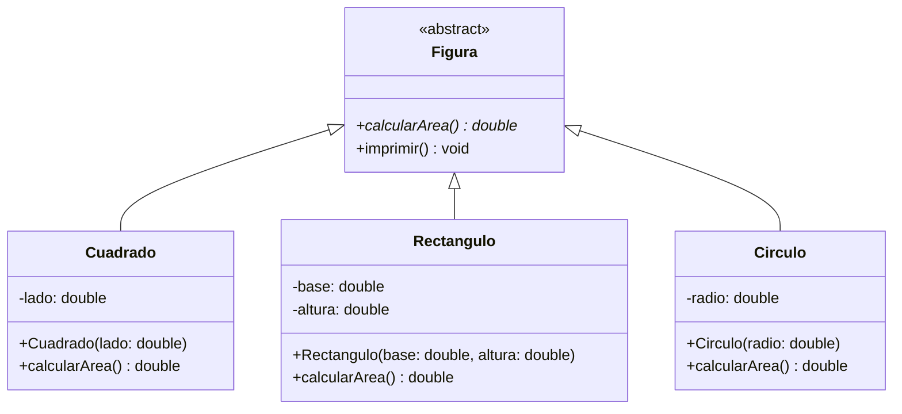

# 📐 Ejercicio de Polimorfismo: Figuras Geométricas

¡Hola, estudiante! 👋 En este laboratorio practicarás los conceptos de **Clases Abstractas** y **Polimorfismo** en Java.

## 🎯 Objetivo
Implementar una jerarquía de clases donde una clase base define un comportamiento obligatorio que cada subclase debe resolver de manera única.

## 🏗️ Estructura del Proyecto

A continuación se muestra el diseño que debes seguir. Asegúrate de respetar los nombres de los métodos y atributos para que las pruebas automáticas puedan validar tu código.



## 📝 Instrucciones

1.  **Clase `Figura` (Abstracta):**
    *   Debe contener un método abstracto `public abstract double calcularArea()`.
    *   Debe contener un método concreto `public void imprimir()` que muestre en consola el área calculada.
2.  **Clases Concretas:**
    *   **`Cuadrado`**: Debe recibir el `lado` en su constructor y calcular el área como `lado * lado`.
    *   **`Rectangulo`**: Debe recibir `base` y `altura` en su constructor y calcular el área como `base * altura`.
    *   **`Circulo`**: Debe recibir el `radio` en su constructor y calcular el área usando `Math.PI * radio * radio`.

## 🚀 ¿Cómo entregar?

1.  Completa la implementación de las clases en este paquete.
2.  Abre una terminal en la raíz del proyecto y ejecuta:
    ```bash
    mvn test
    ```
3.  Si todos los tests pasan localmente (`BUILD SUCCESS`), sube tus cambios y crea un **Pull Request** a la rama principal.
4.  **Importante:** El sistema de Integración Continua (CI) verificará tu código automáticamente. Solo se permitirá el *merge* si las pruebas unitarias son exitosas (verás un check verde ✅ en GitHub).

---
*Laboratorio de Programación II - UNIAJC*
